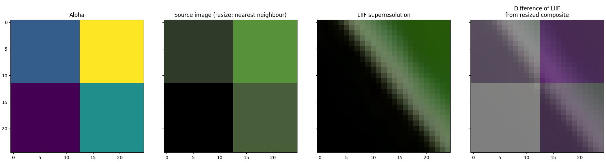
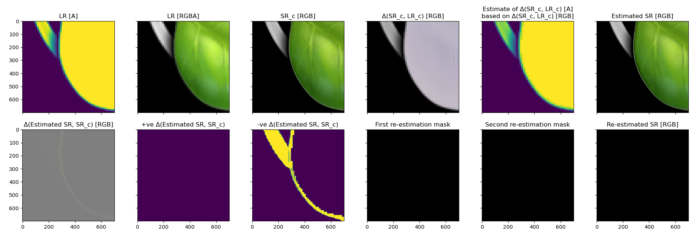

# emoji-liif

Emoji upsampling workflow using LIIF

## Preprocessing

All TTF glyphs were matched to the emojipedia reference images (excluding one 'hidden' glyph),
with the assistance of image hashing functions (however these are not used in the final version,
instead name matching rules were used to correspond icons to the original glyphs).

## Usage

To enlarge the extracted glyphs, run `enlarge_osx_glyphs.py` which will populate the `enlarged`
directory (skipping any glyphs already enlarged in this way). By default this will be sped up
by multiprocessing on all available cores.

## Requirements

See [requirements.txt](requirements.txt)

- [LIIF](https://github.com/yinboc/liif)
  - Currently this requires a sibling directory `../liif/` with LIIF installed there (change this in the `path_to_liif_script` and
    `path_to_model` variables in `enlarge_osx_glyphs.py`)
  - Python 3
  - PyTorch >= 1.6.0
    - If your CUDA is greater than 10.2 then get a more recent PyTorch e.g. 1.7.1
    - See [here](https://pytorch.org/get-started/locally/)
  - Depends: `TensorboardX, yaml, numpy, tqdm, imageio`
- `bs4, requests, fonttools, matplotlib, more_itertools, imagehash, pandas, scikit-image`

I get everything via `pip` except `cudatoolkit` and `torch`/`torchvision` which come via conda (`-c pytorch`)

- via [this GitHub issue comment](https://github.com/pytorch/pytorch/issues/46794#issuecomment-718190681)

However there is currently an [open bug](https://github.com/pytorch/pytorch/issues/51080) in PyTorch
resolvable by changing the CUDA toolkit dependency to `cudatoolkit>=11.0,<11.0.221`

```sh
conda create -n liif_env
conda activate liif_env
# gives cudatoolkit=11.0.3:
conda install "cudatoolkit>=11.0,<11.0.221" -c conda-forge
# gives pytorch=1.7.1, torchvision=0.8.2, also adds python=3.8.5:
conda install pytorch torchvision -c pytorch 
# Install the rest via PyPi:
pip install $(cat requirements.txt | grep -Ev "^(torch(vision)?)$")
```

## Results

The results are nice from 160x160 PNGs extracted from the font TTF.


> See [this thread](https://twitter.com/permutans/status/1345484017609691136) on Twitter for some examples

However, to call this complete I'd want to recover equivalent PNGs, including transparency,
and for this alpha decomposition is required.

This turned out to be tricky!

Attempting to run the alpha channel through LIIF failed to recover a mask matching the
superresolved glyph (RGB channels) so instead I'm planning to estimate it from the RGB:


> Figure generated from 🍃 ([`U+1F343`](osx/catalina/glyph-u1F343.png))
> by [`restore_alpha_to_enlarged_subview.py`](restore_alpha_to_enlarged_subview.py)



> Closer up generated by [`restore_alpha_to_enlarged_2x2_subview.py`](restore_alpha_to_enlarged_2x2_subview.py)

The [alpha channel estimation](Bad_SR_transparency_estimate.ipynb) results were pretty poor (TODO)


After doing a fair bit of closer inspection I still can't figure out precisely how to "pull up" the
pixels that get given an alpha too low (and guessing too naively would degrade the result).
Perhaps 50% of the way there after restating the problem as minimising the loss after re-alpha compositing,
and carrying out the re-estimation in 2 passes (once for pixels with a "uniform loss" e.g. pixel RGB
differences of `(10,10,10)`, and a second for pixels with a "partial loss" e.g. RGB difference of
`(11,12,13)` for which only the minimum (11) would be re-calibrated -- as all backgrounds are
grayscale).


> A further attempt to recover the SR image generated by [`reestimate_leaf_sr_transparency.py`](reestimate_leaf_sr_transparency.py)
> resulting in an improvement but not a perfect fix (yet)



> Here's the beginning of a second pass (from which it can be seen that the first pass didn't fully
> resolve the pixels in the loss mask, _bottom left_, which is less intense but still not uniformly grey).
> Generated by [`further_reestimate_leaf_sr_transparency.py`](further_reestimate_leaf_sr_transparency.py)

Yinbo Chen, first author of the LIIF paper,
[says](https://github.com/yinboc/liif/issues/12#issuecomment-761765468):

> I am not very familiar with the processing of alpha channel. Since the model is only trained for
> RGB images, the alpha channel will make it an out-of-distribution task. If there are a large
> amount of LR-HR pairs of images with alpha channel, a straight-forward method is to modify the
> code to work on 4-channel images (since all the code assume 3-channel, there can be many necessary
> modifications such as the encoder model part and the data normalization part) and train a
> 4-channel SR model.

There's an issue on another project with pretty much the same suggestion
[here](https://github.com/thekevinscott/UpscalerJS/issues/8) and reaching the same conclusion. The
only question is where to find a DIV2K-like dataset of semi-transparent images (note: not 'stickers'
with simply binary alpha)

TODO...

## Workflow

- Image thumbnails (transparent PNGs) are converted to nontransparent by selecting a colour not used
  in the image and flattening with this as a background colour (either in Python, or imagemagick `convert`)
  - Upon calculation, the RGB value of this alpha colour is stored in a database
- Image thumbnails are upsampled (i.e. enlarged) using LIIF
- The resulting large (2000x2000) 'high resolution' images are restored to transparency by removing
  the alpha colour [retrieved from the database]

## TODO

- [#2:](https://github.com/lmmx/emoji-liif/issues/2) add background info on the LIIF method
- Find a dataset of images with alpha channel (DIV2K has 1000 images in 8:1:1 split) and train a 4
  channel model to avoid having to alpha decomposite
  - Alternatively find some way to supervise the decompositing (there are no such datasets around...)
- PyTorch 1.8.0 introduced `set_per_process_memory_fraction`, not clear whether this will be more 
  desirable (it sounds like it raises a CUDA out of memory error if the process tries to take more
  memory than allocated, which is happening anyway with multiple processes, so I don't know if this
  would actually help unless there was a way for the process to detect the size of its
  allocation...)
  - Check to see if perhaps allowing only half the CPU cores would speed up the total run time,
    which would be the case if the bottleneck was at the GPU rather than CPU
  - If it's helpful, see if PyTorch will work with 1.8.0

## Source image provenance

The two emoji image sets are sourced from:

- Emojipedia (iOS 14.2) 72x72 PNG
- OSX 10.15 (Catalina) 160x160 PNG

## Copyright

All credit and copyright belongs to Apple for the iOS/OSX emoji character images, reproduced here
under fair use and for noncommercial purposes.

Emojipedia's _[Emoji Image Licensing](https://emojipedia.org/licensing/)_ page states:

> To the best of our knowledge, specific information about licensing emojis from Apple... is not publicly available.
> 
> Unless otherwise stated, emoji images are © copyright, and enquiries about commercial
> licensing of emoji images should be directed to their respective font vendors.

They also link to [a 2017 blog post, _“Who Owns Emoji?”_](https://blog.emojipedia.org/who-owns-emoji/), which states:

> Apple has not made licensing options publicly available for Apple Color Emoji.
> 
> As such, those wanting to use Apple’s emoji images may be restricted to using these images in a way
> that could be considered fair use.

[Conventional reading](https://guides.nyu.edu/fairuse) of fair use includes such purposes as:

> "limited use of copyrighted material without permission for purposes such as criticism,
> parody, news reporting, research and scholarship, and teaching."
