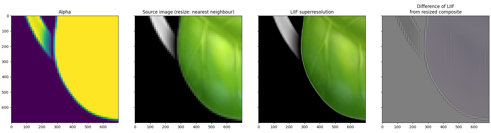

# emoji-liif

Emoji upsampling workflow using LIIF

## Preprocessing

All TTF glyphs were matched to the emojipedia reference images (excluding one 'hidden' glyph),
with the assistance of image hashing functions (however these are not used in the final version,
instead name matching rules were used to correspond icons to the original glyphs).

## Results

The results are nice from 160x160 PNGs extracted from the font TTF, but alpha decomposition is
tricky. Attempting to run the alpha channel through LIIF failed to recover a mask matching the
superresolved glyph (RGB channels) so instead I'm planning to estimate it from the RGB:

Work in progress...

## Workflow

- Image thumbnails (transparent PNGs) are converted to nontransparent by selecting a colour not used
  in the image and flattening with this as a background colour (either in Python, or imagemagick `convert`)
  - Upon calculation, the RGB value of this alpha colour is stored in a database
- Image thumbnails are upsampled (i.e. enlarged) using LIIF
- The resulting large (2000x2000) 'high resolution' images are restored to transparency by removing
  the alpha colour [retrieved from the database]

## TODO

- [#2:](https://github.com/lmmx/emoji-liif/issues/2) add background info on the LIIF method

## Source image provenance

The two emoji image sets are sourced from:

- Emojipedia (iOS 14.2) 72x72 PNG
- OSX 10.15 (Catalina) 160x160 PNG

## Copyright

All credit and copyright belongs to Apple for the iOS/OSX emoji character images, reproduced here
under fair use and for noncommercial purposes.

Emojipedia's _[Emoji Image Licensing](https://emojipedia.org/licensing/)_ page states:

> To the best of our knowledge, specific information about licensing emojis from Apple... is not publicly available.
> 
> Unless otherwise stated, emoji images are © copyright, and enquiries about commercial
> licensing of emoji images should be directed to their respective font vendors.

They also link to [a 2017 blog post, _“Who Owns Emoji?”_](https://blog.emojipedia.org/who-owns-emoji/), which states:

> Apple has not made licensing options publicly available for Apple Color Emoji.
> 
> As such, those wanting to use Apple’s emoji images may be restricted to using these images in a way
> that could be considered fair use.

[Conventional reading](https://guides.nyu.edu/fairuse) of fair use includes such purposes as:

> "limited use of copyrighted material without permission for purposes such as criticism,
> parody, news reporting, research and scholarship, and teaching."
